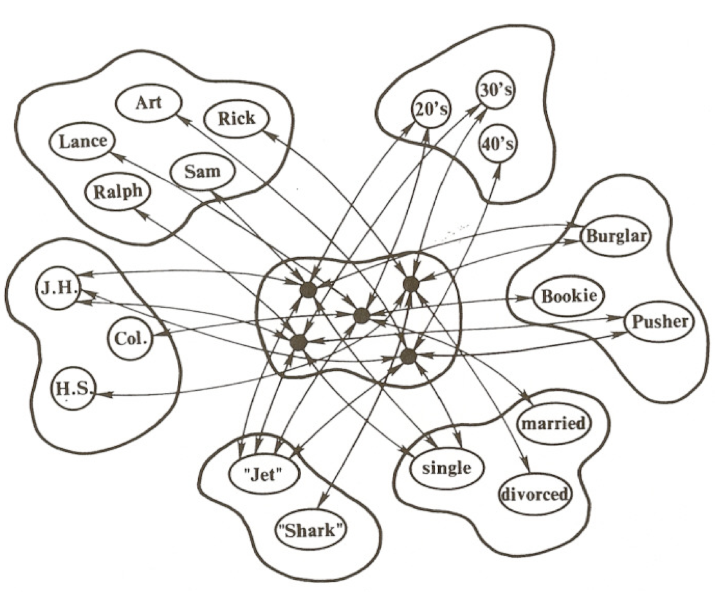

## General Overview

The present works provides a demonstration in R of an Interactive Activation and Competition (IAC) model. Models such as this one stem from the parallel-distributed processing (PDP) tradition and can offer a mechanistic, biologically plausible account of psychological phenomena at an algorithmic level. The Jets and the Sharks model, here, provides a window into how knowledge retrieval might work.

## The Network

The network consists of units organized into pools. Each unit is connected to every other unit. Between pools, connections are bidirectionally excitatory, and within pools units are bidirectionally inhibitory. Strength of connection between units correspond to likely co-occurence of activation between units. Activation is the only currency of the network.

Here is a diagram of the network: 

<p align='center'>

</p>

For more details about this model, both in general and more specifically, see the [PDP Handbook](https://web.stanford.edu/group/pdplab/pdphandbook/handbookch3.html#x7-190002). 

<br>

## Contents

+ Network parameters are set [here](#parameters)
+ Network-pertinent functions are defined [here](#functions)
+ Weighted connections between units are set [here](#connections)
+ Pools are defined [here](#definepools)
+ Skip to a worked example [here](#example1). 


## The Code

#### Load packages
```{r load packages}
# load packages
library(dplyr)
library(ggplot2)
library(reshape2)
library(knitr)
library(kableExtra)
```

#### Set parameters {#parameters}
```{r parameters}
# set parameters
max <- 1
min <- -0.2
rest <- -0.1
decay <- 0.1
estr <- 0.4 
alpha <- 0.2 # see note (below)
gamma <- 0.1

# note: we increased alpha from the parameter value in pdp handbook (where alpha = 0.1) . The reason is that without this excitation scaling parameter increase, intrapool competition squashes activations of all units without external input, and so we fail to see interactivity reflected in final activations of units in the input pools... 

# set number of cycles
ncycles <- 100
```

#### Define functions {#functions}

##### Funtion: pool
```{r define pool functions}
# define pool function
pool <- function(n, name, type, nunits, unit_names, projections, weights, extInput = NA) {
  
  # n: pool number (numeric)
  # name: name of pool (e.g., 'hidden') (string)
  # type: type of pool (e.g., 'input') (string)
  # nunits: number of units in pool (numeric)
  # projections: list of pools (list)
  # weights: list of weight matrices indexed by pool (list)
  
  if(is.na(extInput)) {
    extInput <- matrix(0, ncol = nunits, nrow = 1)
  }
  
  return(list("pool_number"= n,
              "name" = name,
              "type" = type, # hidden or input
              "nunits" = nunits,
              "unit_names" = unit_names,
              "projections" = projections,
              "weights" = weights,
              "extInput" = extInput, 
              "activation" = matrix(0, ncol = nunits, nrow = 1), 
              "inhibition" = matrix(0, ncol = nunits, nrow = 1),
              "excitation" = matrix(0, ncol = nunits, nrow = 1),
              "netInput" = matrix(0, ncol = nunits, nrow = 1), 
              "activation_history" = list()
              ))
}

# define function to set external input to pool 
set_extInput <- function(pool_i, input) {
  pool_i$extInput <- matrix(input, nrow = 1)
  return(pool_i)
}
```

##### Function: run_simulation
```{r define run_simulation function}
run_simulation <- function(pool_, ncycles) {
  # pool_: list of pools in network
  # ncycles: number of cycles in simulation 
  
for (x in 1:ncycles) {

# get net
for (i in seq_along(pool_)) {
  pool_[[i]]$excitation <- matrix(0, nrow=1, ncol = pool_[[i]]$nunits)
  pool_[[i]]$inhibition <- matrix(0, nrow=1, ncol = pool_[[i]]$nunits)
  
  for (sender in pool_[[i]]$projections) {
    positive_acts_indices <- which(pool_[[sender]]$activation > 0 )
    if (length(positive_acts_indices) > 0) {
      for (k in 1:length(positive_acts_indices)) {
        index <- positive_acts_indices[k]
        wts <- pool_[[i]]$weights[[as.character(sender)]][index, ] ### 
        pool_[[i]]$excitation[wts > 0] <- pool_[[i]]$excitation[wts > 0] + pool_[[sender]]$activation[[index]] * wts[wts > 0]
        pool_[[i]]$inhibition[wts < 0] <- pool_[[i]]$inhibition[wts < 0] + pool_[[sender]]$activation[[index]] * wts[wts < 0]
        
      } # end for
    } # end conditional
    pool_[[i]]$excitation <- pool_[[i]]$excitation * alpha
    pool_[[i]]$inhibition <- pool_[[i]]$inhibition * gamma
    pool_[[i]]$netInput <- pool_[[i]]$excitation + pool_[[i]]$inhibition + estr*pool_[[i]]$extInput
  }
}

# update
for (i in seq_along(pool_)) {
  pns <- which(pool_[[i]]$netInput > 0) 
  if (length(pns) > 0) {
    pool_[[i]]$activation[pns] <- pool_[[i]]$activation[pns] + 
      (max - pool_[[i]]$activation[pns])*pool_[[i]]$netInput[pns] -
      decay*(pool_[[i]]$activation[pns] - rest) ### 
  } # end if
  nps <- which(pool_[[i]]$netInput <= 0) 
  if (length(nps) >0) {
    pool_[[i]]$activation[nps] <- pool_[[i]]$activation[nps] + 
      (pool_[[i]]$activation[nps] - min)*pool_[[i]]$netInput[nps] - 
      decay*(pool_[[i]]$activation[nps] - rest)
  } # end if
  
  pool_[[i]]$activation[pool_[[i]]$activation > max] <- max
  pool_[[i]]$activation[pool_[[i]]$activation < min] <- min
  
  #save activation to history
  pool_[[i]]$activation_history[[x]] <- pool_[[i]]$activation
  
} # end for

} # end 100 cycles
  return(pool_)
}
```


##### Function: plot_pools
```{r function to plot activation in each pool}
# plot activations per pool over time
plot_pools <- function(pool_) {

# pool 1 features
a_history_1 <- pool_[[1]]$activation_history
unit_names_1 <- pool_[[1]]$unit_names
m1 <- do.call(rbind, a_history_1)
colnames(m1) <- unit_names_1
plot1 <- ggplot(melt(m1), aes(x=Var1, y=value, col=Var2)) + 
  labs(x = "Cycle", y = "Activation", color = "Feature", title = "Activation of Feature Units by Cycle") +
  geom_line() 

# pool 2 names
a_history_2 <- pool_[[2]]$activation_history
unit_names_2 <- pool_[[2]]$unit_names

m1 <- do.call(rbind, a_history_2)
colnames(m1) <- unit_names_2
plot2 <- ggplot(melt(m1), aes(x=Var1, y=value, col=Var2)) + 
  labs(x = "Cycle", y = "Activation", color = "Name", title = "Activation of Name Units by Cycle") +
  geom_line() 

# pool 3 - hidden 
a_history <- pool_[[3]]$activation_history
unit_names <- pool_[[3]]$unit_names

m1 <- do.call(rbind, a_history)
colnames(m1) <- unit_names
plot3 <- ggplot(melt(m1), aes(x=Var1, y=value, col=Var2)) + 
  labs(x = "Cycle", y = "Activation", color = "Hidden Unit", title = "Activation of Hidden Units by Cycle") + 
  geom_line() 

return(list("features" = plot1, "names" = plot2, "hidden" = plot3))
}

```


##### Function: rank_activations_by_pool
```{r function to interpret network output}
# rank final activations by pool 
rank_activations_by_pool <- function(pool_) {

features_out <- pool_[[1]]$activation
colnames(features_out) <- pool_[[1]]$unit_names
names_out <- pool_[[2]]$activation
colnames(names_out) <- pool_[[2]]$unit_names
hidden_out <- pool_[[3]]$activation
colnames(hidden_out) <- pool_[[3]]$unit_names


f_df <- data.frame(feature = colnames(features_out)[order(features_out, decreasing = T)], 
                   activation = features_out[order(features_out, decreasing = T)])

n_df <- data.frame(name = colnames(names_out)[order(names_out, decreasing = T)], 
                   activation = names_out[order(names_out, decreasing = T)])

h_df <- data.frame(name = colnames(hidden_out)[order(hidden_out, decreasing = T)], 
                   activation = hidden_out[order(hidden_out, decreasing = T)])

return(list('features' = f_df, 'names' = n_df, 'hidden' = h_df))
}

```

#### Set weighted connections {#connections}

##### Features to features weights
```{r features to features}
# Features to Features [14 x 14]
# [1] Jets	Sharks	20s	30s	40s	JH	HS	COL	
# [9] Single	Married	Divorced	Bookie 	Burglar	Pusher
f2F <- read.csv("csvs/JS_features2features.csv")
row.names(f2F) <- f2F[,1]
f2F <- f2F %>% select(-X)
f2F <- as.matrix(f2F)
```

##### Features to hidden weights
```{r features to hidden}
# features to hidden matrix
f2H <- read.csv("csvs/JS_features2Hidden.csv") 
f2H$Divorced[f2H$Divorced == "1`"] <- "1"
f2H$Divorced <- as.numeric(f2H$Divorced)
f2H$Divorced[f2H$Divorced == 1] <- 0
f2H$Divorced[f2H$Divorced == 2] <- 1
f2H[is.na(f2H)] <- 0
row.names(f2H)<- f2H[,1]
# convert to matrix
f2H <- f2H %>% select(-X) %>% as.matrix()
```

##### Names to names weights
```{r names to names}
# names to names [27 x 27]
# [1] Art	Al	Sam	Clyde	Mike	Jim	Greg	John	Doug	Lance	George	Pete	
# [13] Fred	Gene	Ralph	Phil	Ike	Nick	Don	Ned	Karl	Ken	Earl	Rick	Ol	Neal	Dave
n2N <- matrix(-1, nrow = 27, ncol = 27)
diag(n2N) <- 0
```

##### Names to hidden weights
```{r names to hidden}
# names to hidden [27 x 27]
# [1] Art	Al	Sam	Clyde	Mike	Jim	Greg	John	Doug	Lance	George	Pete	
# [13] Fred	Gene	Ralph	Phil	Ike	Nick	Don	Ned	Karl	Ken	Earl	Rick	Ol	Neal	Dave
n2H <- diag(1, nrow = 27, ncol = 27)
```

##### Hidden to hidden weights
```{r hidden to hidden}
# hidden to hidden [27 x 27]
# [1] Art	Al	Sam	Clyde	Mike	Jim	Greg	John	Doug	Lance	George	Pete	
# [13] Fred	Gene	Ralph	Phil	Ike	Nick	Don	Ned	Karl	Ken	Earl	Rick	Ol	Neal	Dave
h2H <- n2N # same as n2N
```

### Define pools in network {#definepools}
Here we define three pools: a features pool, a names pool and a hidden pool. 

```{r}

featurePool <- pool(1, "features", "input", 14, 
                 unit_names = c("Jets", "Sharks","20s",	"30s"	,"40s", "JH", "HS", "COL",
                                "Single", "Married", "Divorced", "Bookie", "Burglar", "Pusher"),
                 projections = c(1, 3), 
                 weights = list('1'=f2F, '3'=f2H)
                 )

namePool <- pool(2, "names", "input", 27, 
                 unit_names = c('Art',	'Al',	'Sam',	'Clyde',	'Mike',	'Jim',	'Greg',	'John',	'Doug',	
                                'Lance',	'George',	'Pete',	'Fred',	'Gene',	'Ralph',	'Phil',	'Ike',	
                                'Nick',	'Don',	'Ned',	'Karl',	'Ken',	'Earl',	'Rick',	'Ol',	'Neal',	
                                'Dave'),
                 projections = c(2, 3), 
                 weights = list('2'=n2N, '3'=n2H))

hiddenPool <- pool(3, "hidden", "hidden", 27, 
                 unit_names = c('Art',	'Al',	'Sam',	'Clyde',	'Mike',	'Jim',	'Greg',	'John',	'Doug',	
                                'Lance',	'George',	'Pete',	'Fred',	'Gene',	'Ralph',	'Phil',	'Ike',	
                                'Nick',	'Don',	'Ned',	'Karl',	'Ken',	'Earl',	'Rick',	'Ol',	'Neal',	
                                'Dave'),
                 projections = c(1, 2, 3), 
                 weights = list('1'=t(f2H), '2'=t(n2H), '3'=h2H))

```

# IAC in Action: Knowledge Retrieval by Content and by Name {#example1}

Imagine that you know the following individuals (see Jets and Sharks table below) - what they do for work, their level of education, how old they are, whether or not they are married or single, and what group they belong to. 

**Ex. In passing someone mentions an individual in his 20s who only completed junior high. Who comes to mind?** 

The characteristics (20s and Junior High) mentioned in passing most likely bring to mind a subset of folks who possess these or related characteristics.  An associative network like the one here offers an explanation of how these associations might faciliate knowledge retrieval in the brain.

**Ex. In conversation someone mentions a group of young people in their twenties without naming the particular group. which group comes to mind?** 

The Jets might come to mind, even though *you need not explicitly know that the Jets have 9 members in their 20s and that the Sharks only have one*. Rather the associations you've developed over time between twenty-somethings and the Jets allow you to predict (i.e., generalize from specific knowledge) that the person is most likely talking about members of the Jets.

The following examples demonstrate how an associative network in which activation is only currency can facilitate knowledge retrieval and generalization.

### Jets and Sharks Table
Members of the Jets and the Sharks and their corresponding features.
```{r load jets and sharks table, echo = FALSE}
js <- read.csv('csvs/jetsSharks.csv', header = F)
colnames(js) <- c("Name", "Affiliation", "Age", "Education", "Relationship Status", "Occupation" )
kable(js) %>% kable_styling(bootstrap_options = "striped", full_width = F)
```

## Example 1: Who is in his 20s and has only completed junior high?
We know that Jim, John, Lance are George are the only individuals both in their 20s and with junior high level of education. So, we expect units corresponding to Jim, John, Lance and George to have the highest hidden unit activations. 

Let's take a look at hidden unit, and feature unit activations over time (i.e., per cycle).

```{r set external input, echo=FALSE}
featurePool <- set_extInput(featurePool, c(0, 0, 1, 0, 0, 1, 0, 0, 0, 0, 0, 0, 0, 0)) # features of JH and 20s
namePool <- set_extInput(namePool, c(0, rep(0, 26))) # no names
```

```{r run simulation, echo=FALSE}
pool_ <- list(featurePool, namePool, hiddenPool)
pool_ <- run_simulation(pool_, 100)
```

```{r plot activations of each pool over time, echo=FALSE}
nnplot <- plot_pools(pool_)
nnplot$hidden
nnplot$features
```

As expected, we see that the units corresponding to Jim, John, Lance and George do have the highest activation levels in the hidden pool. 

```{r identify *winning* units in each pool, echo=FALSE}
ranked_activations <- rank_activations_by_pool(pool_)
kable(ranked_activations$hidden) %>% kable_styling(bootstrap_options = "striped", full_width = F)

```

Additionally, we can also examine activations in the feature pool to see which other features are most likely (given JH and 20s). For such individuals, the next most likely features are Jets and burglar (that is, these units have next highest activation levels).

```{r , echo=FALSE}
kable(ranked_activations$features) %>% kable_styling(bootstrap_options = "striped", full_width = F)
#kable(ranked_activations$names) %>% kable_styling(bootstrap_options = "striped", full_width = F)

```

We confirm that the Jim, John, Lance and George are, in fact, all members of the Jets and are burglars (see Jets and Sharks Table). Thus, the network successfully predicts features associated with individuals who are in their 20s with education level of JH. 

## Example 2: Who is Art? 
Here, we input activation to the name unit corresponding to Art and see what features the network predicts. 

Let's take a look at feature units activation over time to see what characteristics are most likely associated with Art.

```{r ex2: set external input, echo=FALSE}
# set external input
featurePool <- set_extInput(featurePool, c(0, 0, 0, 0, 0, 0, 0, 0, 0, 0, 0, 0, 0, 0)) # no ext input to features
namePool <- set_extInput(namePool, c(1, rep(0, 26))) # ext input to Art 
```

```{r ex2: run simulation, echo=FALSE }
pool_ <- list(featurePool, namePool, hiddenPool)
pool_ <- run_simulation(pool_, 100)
```

```{r ex2: plot activations of each pool over time, echo=FALSE}
nnplot <- plot_pools(pool_)
# nnplot$hidden
nnplot$features
```

```{r ex2: identify *winning* units in each pool , echo=FALSE}
ranked_activations <- rank_activations_by_pool(pool_)
kable(ranked_activations$features) %>% kable_styling(bootstrap_options = "striped", full_width = F)
```

Based on the final activations of the features pool, Art is a Jet, in his 40s, single, a pusher, and only completed junior high. We confirm that Art's predicted features match his actual features (see Jets and Sharks Table).

## Conclusion

The IAC model presented above offers a window into the exciting world of cognitive modeling! For more information check out the [PDP handbook](https://web.stanford.edu/group/pdplab/pdphandbook/) in its entirety. And good luck coding!